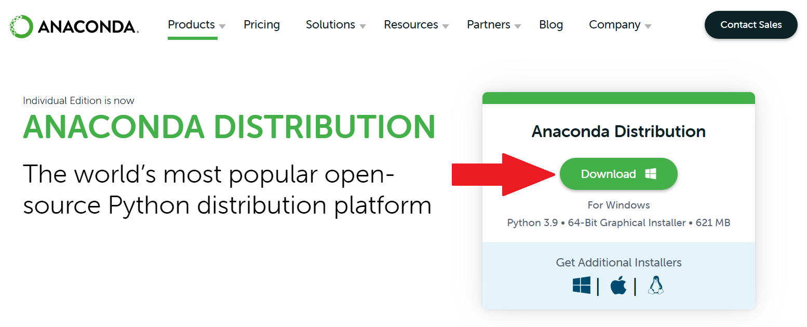
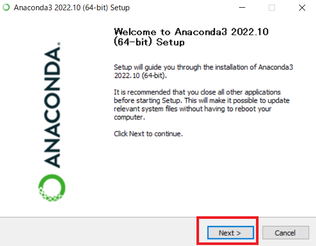
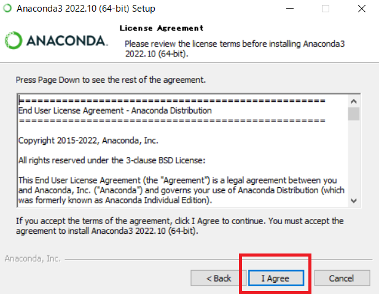
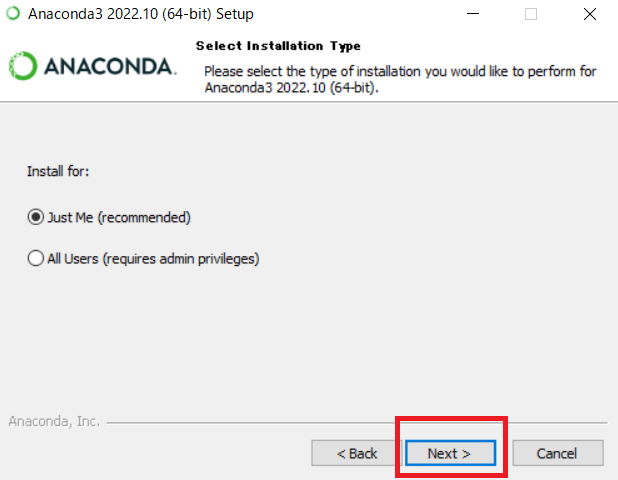
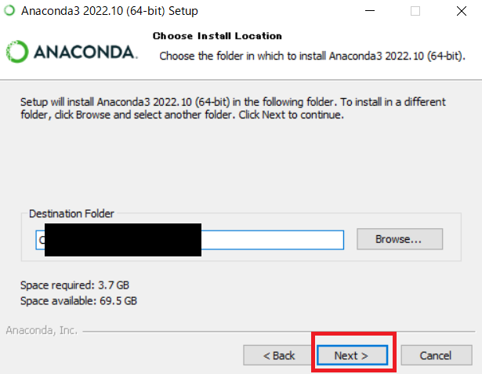
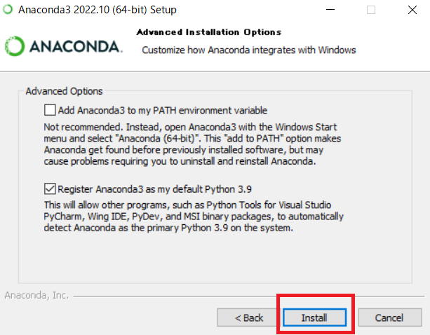

# 環境構築手順


## 目次

- [環境構築手順](#環境構築手順)
  - [目次](#目次)
  - [Pythonのインストール](#pythonのインストール)
    - [インストール手順](#インストール手順)
    - [参考ページ](#参考ページ)
  - [Pythonライブラリのインストール](#pythonライブラリのインストール)
    - [ライブラリのインストール方法](#ライブラリのインストール方法)
    - [インストールが必要なライブラリ](#インストールが必要なライブラリ)

## Pythonのインストール

- Anacondaを利用してPythonのインストールを行う方法を紹介します．

### インストール手順

1. Anaconda公式サイトの[ダウンロードページ(https://www.anaconda.com/products/distribution)](https://www.anaconda.com/products/distribution)にアクセスします．

2. 「Download」をクリックして，インストーラ(Anaconda3-2022.10-Windows-x86_64.exeの様なファイル名)をダウンロードします．
   - 特に理由が無ければ3系のPythonを選択します．

    

3. インストーラを実行し起動します．
   - ダブルクリックまたは右クリックで現れるメニューから実行を選択します．

4. 各項目について，「Next」または「I agree」を選択し先に進めます．
   - インストール先ディレクトリのパスには日本語を含まない事を推奨します．
   - 「Just Me」と「All Users」について
     - Anacondaを現在のユーザのみで使用する場合は「Just Me」を，全てのユーザで利用可能にする場合は「All Users」を選択します．
   - Pathの追加について
     - 「Add Anaconda3 to my PATH environment variable」を選択すると環境変数PathにAnacondaのパスを追加します．この場合，Python実行時にAnaconda以外のPythonが使用される可能性があります．
     - 「Register Anaconda3 as the system Python 3.x」を選択するとAnacondaをデフォルトのPythonとして登録します．

    <br>
    
    
    <br><br>
    
    
    <br>

5. 「Install」を選択し，インストールを開始します．

    

6. 最後に「Finish」を選択します．

7. インストールが終了次第，次の手順でPythonがインストールできているか確認を行います．
   1. 「Anaconda Prompt」を立ち上げます．
   2. `Python -V`というコマンドを打ち込み，実行します．
   3. インストール済みのPythonのバージョンが表示されることを確認します．


### 参考ページ

- Python Japan
  - [Python環境構築ガイド](https://www.python.jp/install/install.html)
  - [Anaconda のインストール](https://www.python.jp/install/anaconda/index.html)
  - [Windows版Anacondaのインストール](https://www.python.jp/install/anaconda/windows/install.html)

## Pythonライブラリのインストール
### ライブラリのインストール方法

1. インストールが必要な各種Pythonライブラリを次の様に`pip install`コマンドを実行しインストールします．
   - `<package>`: ライブラリ名

```sh
pip install <package>
```

- 各ライブラリの詳細なバージョンは，「[001_環境構築](../001_環境構築/)」ディレクトリ内の「[requirements.txt](./requirements.txt)」を参照してください．

### インストールが必要なライブラリ

- numpy
- pandas
- matplotlib
- scipy
- joblib
- scikit-learn
- lightgbm
- optuna

