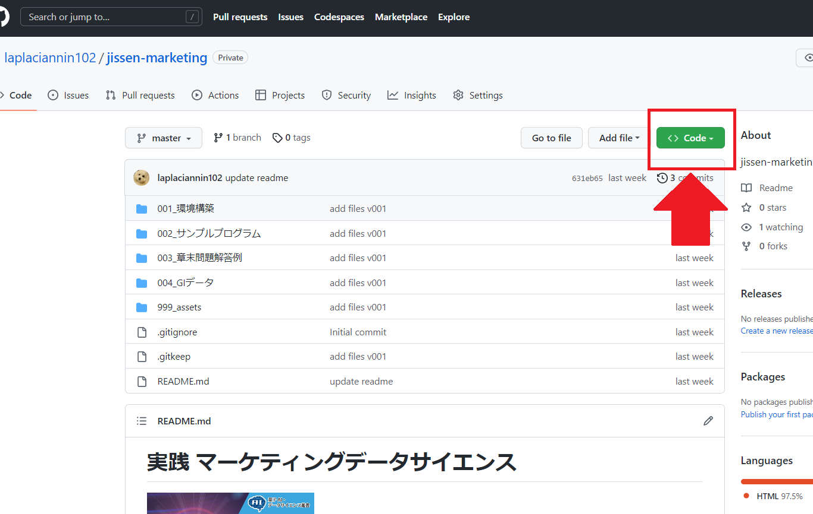
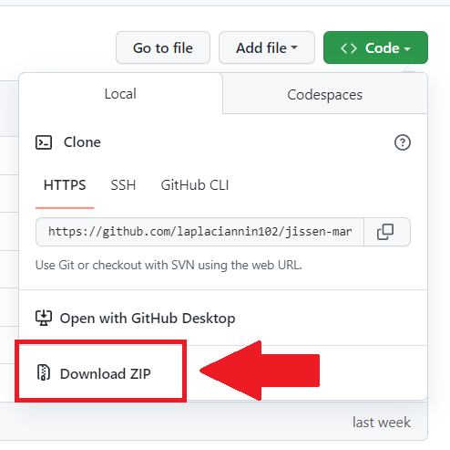
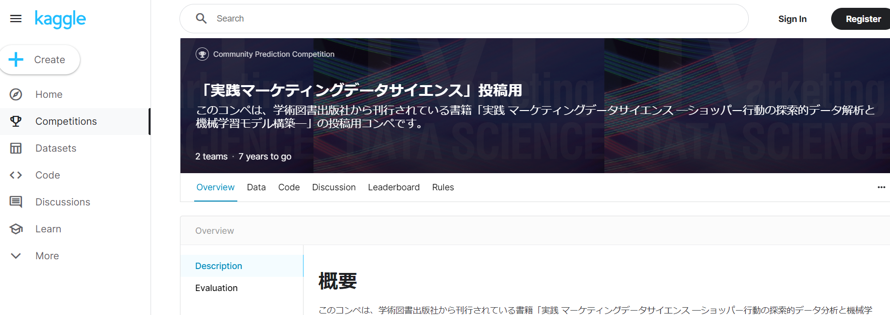

# 実践 マーケティングデータサイエンス


## 目次

- [実践 マーケティングデータサイエンス](#実践-マーケティングデータサイエンス)
  - [目次](#目次)
  - [概要](#概要)
  - [ダウンロード方法](#ダウンロード方法)
  - [ディレクトリ構成](#ディレクトリ構成)
    - [構成図](#構成図)
    - [ファイルの説明](#ファイルの説明)
  - [プログラムの実行環境](#プログラムの実行環境)
  - [プログラム実行前の準備](#プログラム実行前の準備)
  - [分析コンペ(Kaggle)について](#分析コンペkaggleについて)
    - [コンペ概要](#コンペ概要)

## 概要

- 学術図書出版社から刊行されている書籍『実践 マーケティングデータサイエンス』内で使用されているサンプルプログラム等を格納した**GitHubリポジトリ**です．
- 本書の詳細は，[本書のサポートページ](https://www.gakujutsu.co.jp/text/isbn978-4-7806-1051-2/)も合わせてご覧ください．

## ダウンロード方法

1. GitHubリポジトリのURL([https://github.com/laplaciannin102/jissen-marketing](https://github.com/laplaciannin102/jissen-marketing))にアクセスします．

2. 次の`git clone`を使う「方法1」または**Download**する「方法2」でリポジトリ内のプログラム・データを取得します．

   - 方法1: 以下のコマンドを実行し，`git clone`を行います．
     - ※Gitのインストールが必要です

    ```sh
    git clone https://github.com/laplaciannin102/jissen-marketing.git
    ```

   - 方法2:
     - 2-1. リポジトリページの右上の **「<>Code」** というボタンをクリックします．

      

     - 2-2. **「Download ZIP」** をクリックします．

      
    
     - 2-3. zipファイル(圧縮ファイル)のダウンロードが開始されます．ダウンロードしたファイルを解凍して使用します．

## ディレクトリ構成

### 構成図

```
jissen-marketing
├─001_環境構築/
│  ├─001_環境構築.md
│  └─requirements.txt
├─002_サンプルプログラム/
│  ├─input/
│  ├─intermediate/
│  ├─output/
│  └─src/
├─003_章末問題解答例/
│  ├─input/
│  ├─intermediate/
│  ├─output/
│  ├─pdf（別紙）/
│  └─src/
├─004_GIデータ/
│  ├─gi_sample_submit.csv
│  ├─gi_test.csv
│  ├─gi_train_mm10.csv
│  └─gi_train_mm11.csv
├─999_assets/
└─README.md
```

### ファイルの説明

| 階層1                  | 階層2                | 説明                                                       | 
| ---------------------- | -------------------- | ---------------------------------------------------------- | 
| 001_環境構築           |                      | 環境構築用のディレクトリ．                                 | 
|                        | 001_環境構築.md      | 環境構築の説明が書かれたテキストファイル．                 | 
|                        | requirements.txt     | Pythonライブラリのバージョンが書かれたテキストファイル．   | 
| 002_サンプルプログラム |                      | サンプルプログラムのディレクトリ．                         | 
|                        | input                | src内プログラムの入力ファイル格納ディレクトリ．            | 
|                        | intermediate         | src内プログラムの中間ファイル格納ディレクトリ．            | 
|                        | output               | src内プログラムの出力ファイル格納ディレクトリ．            | 
|                        | src                  | 書籍内で使用されているサンプルプログラム格納ディレクトリ． | 
| 003_章末問題解答例     |                      | 章末問題解答例のディレクトリ．                             | 
|                        | input                | src内プログラムの入力ファイル格納ディレクトリ．            | 
|                        | intermediate         | src内プログラムの中間ファイル格納ディレクトリ．            | 
|                        | output               | src内プログラムの出力ファイル格納ディレクトリ．            | 
|                        | pdf（別紙）          | 章末問題解答例の別紙格納ディレクトリ．                     | 
|                        | src                  | 章末問題解答例のプログラム格納ディレクトリ．               | 
| 004_GIデータ           |                      | プログラムで使用するGo Insightデータ．                     | 
|                        | gi_sample_submit.csv | コンペティションのsubmitのsampleデータ．                   | 
|                        | gi_test.csv          | コンペティションのtestデータ．                             | 
|                        | gi_train_mm10.csv    | コンペティションの10月分のtrainデータ．                    | 
|                        | gi_train_mm11.csv    | コンペティションの11月分のtrainデータ．                    | 
| 999_assets             |                      | 素材ディレクトリ．基本的に不使用．                         | 
| README.md              |                      | 本テキストファイル．リポジトリの説明．                     | 


## プログラムの実行環境

- 詳細は「[001_環境構築](./001_環境構築/)」ディレクトリの「[001_環境構築.md](./001_環境構築/001_環境構築.md)」を参照してください．

- 次の環境が用意されていることを想定しています．
  - **Python**: 3.x
  - **インストールが必要なPythonライブラリ**:
    - numpy
    - pandas
    - matplotlib
    - scipy
    - joblib
    - scikit-learn
    - lightgbm
    - optuna

## プログラム実行前の準備

- 「[002_サンプルプログラム](./002_サンプルプログラム/)」および「[003_章末問題解答例](./003_章末問題解答例/)」について，プログラムおよび解答例は「src」ディレクトリに格納されています．
- 「src」内を実行する前の準備として，「input」ディレクトリに「[999_GIデータ](./999_GIデータ/)」ディレクトリ内の全データをコピーしてください．

## 分析コンペ(Kaggle)について

- 本書籍では分析コンペへの参加を通して学習を進めることを想定しています．
- 分析コンペは**Kaggle**にて用意されており，本コンペページは次のURLになります．
  - URL: [https://www.kaggle.com/competitions/jissen-marketing](https://www.kaggle.com/competitions/jissen-marketing)

  

### コンペ概要

- このコンペは，とある小売店舗（スーパーマーケット）で取得した飲料売場のショッパー購買行動データ（GIデータ）を使って，「商品を手に取った人」を，何かひとつでも商品を「購入する人」と，商品をひとつも「購入しない人」とに二値分類する機械学習モデルを構築し，投稿するものです。


